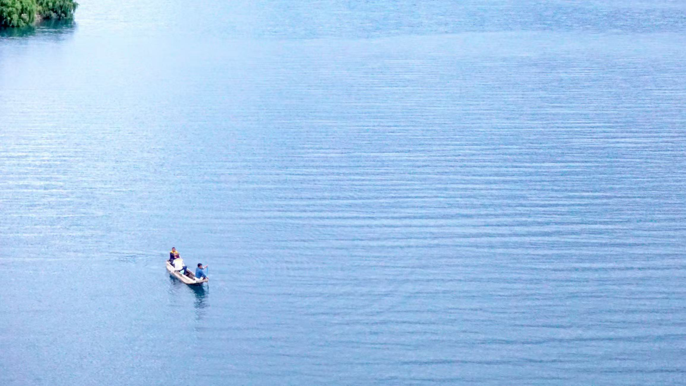
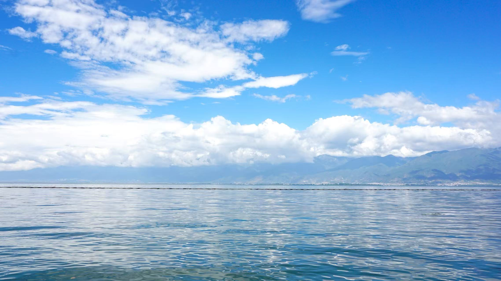

### PART 1 ADVENTURE 

几乎从大三下开始，一直处于极度焦虑的状态，没有足够的文章，没有硬核推荐信，甚至没有很好的英语成绩，内心十分后悔当下的选择。1月初，用十天从托福转到雅思，完成了考试，提交完第一批申请，决心给自己放个假，于是开启了沿着成都-重庆-张家界-长沙-杭州-绍兴的“北纬30度”之旅。 

这是我第一次solo trip，以前一直觉得独自旅行是危险且孤独的，但真正经历的时候发现，似乎还别有一番风味，从此便一发不可收拾。从重庆坐绿皮火车到张家界，车上空空荡荡，没什么人。遇到一个英国来的背包客小姐姐，本着练习英语的心态前去搭话，两人想必都是内向的人，聊了几句便结束对话了。 

在张家界住了两家青旅，碰到了几个很有意思的小伙伴。 
在武陵源的第一晚，抱着电脑去大厅码字，没工作几分钟就被热心的驴友拉去炉边聊天。我们快十来号人围着一个小火炉，炉子里面时不时埋进几颗红薯，等熟了就用铲子捞出来，掰开分给我们，热腾腾地冒着热气，散发着来自土地的清甜。几个人聊了一晚上，还约着第二天由熟悉路的大哥带着一起爬山。这个大哥也是个神奇的人物，听说是个富二代，已经在青旅住了几个月了，为了减肥买了年卡天天去爬山。几年后听说这个大哥已经定居武陵源了，听说是因为爱上了一位张家界的姑娘。 

📍Zhang Jia Jie

此次来张家界就是为了看雾凇的，可惜从武陵源赶回天门山那天刚好回温，去的时候不仅没看到雾凇，还只剩一片厚厚的云雾。 
在天门山定的青旅很小，看起来是私人作坊。到的时候这里只有两个义工，听他们说他们是这家青旅最初的顾客，和老板相交甚好，老板决定全球旅行，想雇人照看店面，就把他两摇去了。男生是个热爱旅行的小弟弟，大学期间跑遍了祖国大江南北，女生是个可爱的小姐姐，因为厌烦家里人过年催婚，所以选择做义工，摆脱那些糟心事儿。 

下一站，按照我定的主题，其实是想去武汉的，但瞅着路费，最终选择了长沙。然而，到达长沙的第一天就听说出现了新型流感，我边逛市区边找药店，试图去购买一些口罩，也没怎么玩尽兴。当天晚上，看新闻报道说事态变得很严重，可能要封城，我便忙不迭地购买了第二天长沙飞杭州的机票，才100元不到，属实是震惊到我了。 

### PART 2 GRADUATION

到了二月，收到了几个offer，可惜由于我的英语没过线，又没法考托福雅思，让我的焦虑进一步加深了。为了保证自己不至于没学上，二月底补申了几个香港的学校。这一年，港科广正式开始招生，我想着也许有机会，便给老师发了邮件。过了两周，我都忘了有这事了，忽然某天中午，我正啃着一只虾，接到了来自香港的电话，第二天老师说愿意给我个联培的机会。感觉像天上掉下了馅饼，我人生的前二十年都没这么幸运过。 

年后到五月这段时间，我都是一个人待在家里，时不时写写毕业论文。本以为会就这样平淡地等到返校，然而中途接到了一个诈骗电话，骗走了我辛苦攒下的几千块钱。很无助，一个人在家哭了很久。跑去派出所报警，却被笑话说，“才被骗这么点钱报什么警”。anyway，反正也是要不回来的了。 

五月底回到学校答辩，六月初毕业典礼。总算是完成了我这四年的学业，感觉比高中都过得辛苦，但也不知道在忙什么。以前有个妹子给我说，我们活着做出的每一个决定，最好都设想一下未来五年甚至十年会有怎么样的改变。 
祝大家前程似锦——— 

  <iframe 
    src="2020.mp4" 
    frameborder="0" 
    allowfullscreen 
    style="position:absolute; top:0; left:0; width:100%; height:100%;">
  </iframe>

匆匆结束了毕业典礼，约着几个小伙伴开启了我们的毕业旅行，目的地：彩云之南。 
小时候很喜欢看一些心灵鸡汤的书，里面描写的云南是轻松且自由的，是四季如春的，也不知道为何，总是会把它和“白茶清欢无别事，我在等风也等你”这句话联系在一起。我们一起去了丽江的小酒馆，去了大理古城，去看了恬静的洱海，去眺望了巍峨的苍山，划船在泸沽湖畔，在土地上用木棍写下对未来的愿景。 
从泸沽湖回来的路上，我们的包车司机被警察查了，我们一头雾水地坐上了警车回到了民宿，也不知道后来这个司机犯了什么错，后来怎么样了。也算是一段很新奇的体验了。 

📍Lugu lake

📍Yulong Snow Mountain

六月底，考完了二专的最后两门考试，总算是和我的大学生活正式说再见了!七月初，按着老师的安排，来到深圳学习。八月底，由于要办理签证，回了趟家，顺便去母校参加了一个活动，有幸上了次地方电视。然而，都没来得及参加完活动，就去赶飞机了，开启我的新的篇章———— 

### Footprint

  <iframe 
    src="https://www.google.com/maps/d/u/0/embed?mid=1qDSAGo6_nydjYiV1M5nPmqzrsUGHwlk&ehbc=2E312F"
    style="position:absolute; top:0; left:0; width:100%; height:100%; border:0;"
    allowfullscreen=""
    loading="lazy">
  </iframe>

