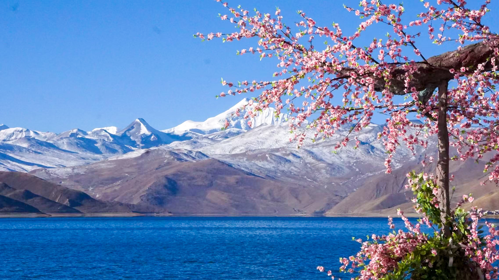

### PART 1 IMPULSION

At the beginning of 2022, I took part in a tour group to Qingyuan, hoping to see the rime ice on the top of Jinzi Mountain. But unfortunately, I didn't get it due to the rising temperatures that day.  

📍Qingyuan  

As I looked out from the mountaintop, a profound longing for snowberg struck me - a feeling that lingered long after.  

Thus, I booked a flight to Tibet for the Spring Festival holiday.  

📍Tibet  

The scenery in Tibet was absolutely breathtaking, from the majestic Potala Palace and ancient glaciers to the stunning Yamdrok Lake. The only drawback was the high altitude sickness, which left me feeling unwell for the entire trip.  

 

### PART 2 HOMESICKNESS

"Bright is the Moon over My Home Village.🌖" 

After the academic conference hosted in Hefei, I passed through Hefei, Huangshan, Hangzhou and finally returned to my hometown, the place I missed for two years! 

  <iframe 
    src="2022.mp4" 
    frameborder="0" 
    allowfullscreen 
    style="position:absolute; top:0; left:0; width:100%; height:100%;">
  </iframe>

 

### Footprint

  <iframe 
    src="https://www.google.com/maps/d/u/0/embed?mid=1ttARfWZ1BXOc0bj7E11OWvaLzrF_cos&ehbc=2E312F" 
    style="position:absolute; top:0; left:0; width:100%; height:100%; border:0;"
    allowfullscreen=""
    loading="lazy">
  </iframe>

